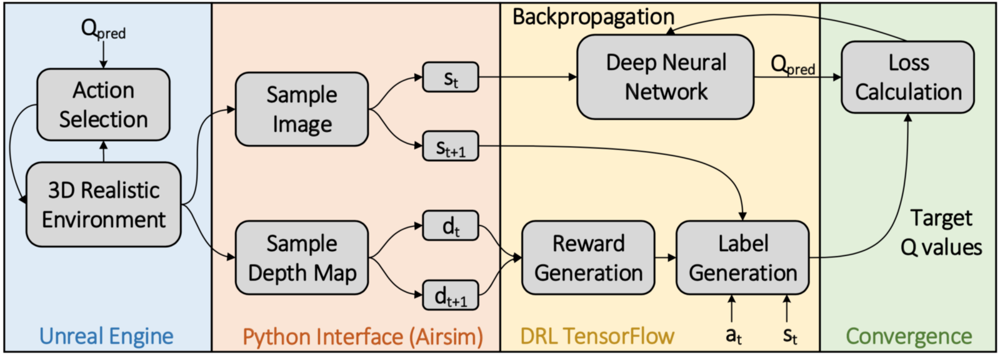
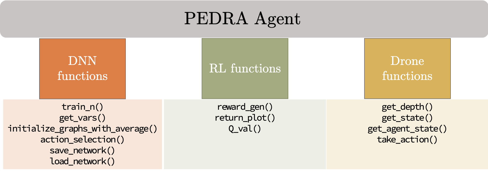
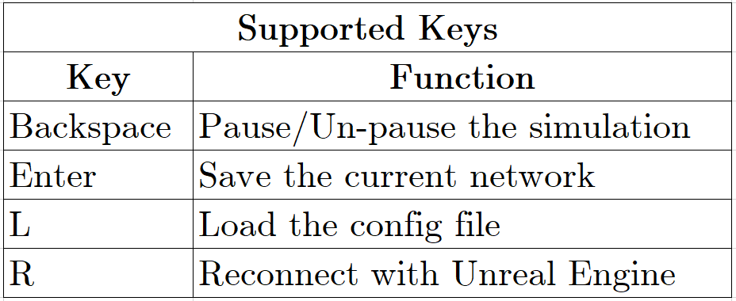
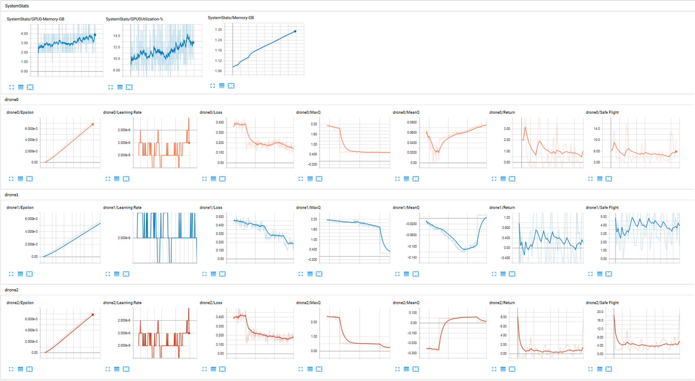

# PEDRA - Provided Algorithms

This readme file explains the PEDRA available algorithms that can be used by setting the algorithm parameter in the config file.

# 1. Deep Q-learning (__*DeepQLearning*__)
```
file: config.cfg

algorithm:    DeepQLearning
```

Value based deep Q learning method for autonomous navigation. The input to the DNN is the image from the front facing camera, while the output is the estimated Q-value of the action in the action space. The algorithm supports
* Double DQN method
* Prioritized Experience Replay
* Distributed learning


## Block Diagram



## Simulation Parameters [simulation_params]:


| Parameter      	| Explanation                                           	| Possible values           	|
|----------------	|-------------------------------------------------------	|---------------------------	|
| load_data      	| Dictates if to load data into the replay memory       	| True / False              	|
| load_data_path 	| The path to load the data from into the replay memory 	| Relative path to the data 	|
| distributed_algo| Select from one of the available distributed learning algorithms 	| GlobalLearningGlobalUpdate, LocalLearningGlobalUpdate, LocalLearningLocalUpdate 	|


## Reinforcement Learning training parameters [RL_params]:


| Parameter              	| Explanation                                                                                     	| Possible values          	|
|------------------------	|-------------------------------------------------------------------------------------------------	|--------------------------	|
| input_size             	| The dimensions of the input image into the network                                              	| Any positive integer     	|
| num_actions            	| The size of the action space                                                                    	| 25, 400 etc              	|
| train_type             	| Dictates number of trainable layers                                                             	| e2e, last4, last3, last2 	|
| wait_before_train      	| The number of iterations to wait before training can begin                                     	  | Any positive integer     	|
| max_iters              	| Maximum number of training iterations                                                           	| Any positive integer     	|
| buffer_len             	| The length of the replay buffer                                                                 	| Any positive integer     	|
| batch_size             	| The batch size for training                                                                     	| 8, 16, 32, 64 etc        	|
| epsilon_saturation     	| The number of iteration at which the epsilon reaches its maximum value                          	| Any positive integer     	|
| crash_thresh           	| The average depth below which the drone is considered crashed                                   	| 0.8, 1.3 etc             	|
| Q_clip                 	| Dictates if to clip the updated Q value in the Bellman equation                                 	| True, False              	|
| train_interval         	| The training happens after every train_interval iterations                                      	| 1,3,5 etc                	|
| update_target_interval 	| Copies network weights from behavior to target network every update_target_interval iterations 	  | Any positive integer     	|
| gamma                  	| The value of gamma in the Bellman equation                                                      	| Between 0 and 1          	|
| dropout_rate           	| The drop out rate for the layers in the network                                                 	| Between 0 to 1           	|
| learning_rate          	| The learning rate during training                                                               	| Depends on the problem   	|
| switch_env_steps       	| The number if iterations after which to switch the initial position of the drone                	| Any positive integer     	|
| epsilon_model          	| The model used to calculate the value of epsilon for the epsilon greedy method                  	| linear, exponential      	|
| communication_interval          	| How often do the drones communication, num of iterations per communication                 	| Any integer value >0     	|
| average_connectivity          	| Each drone is on average connected to how many drones| num_agent > integer > 0|


## Running PEDRA for DeepQLearning:
Following steps need to be taken to run PEDRA for DeepQLearning

### 1. Download imagenet weights for AlexNet
The default deep network used for learning is AlexNet. However other DNNs can be used by defining them as a python class in
```
network/network.py
```

The deep network uses Imagenet learned weights for AlexNet to initialize the layers. Following link can be used to download the imagenet.npy file.

[Download imagenet.npy](https://drive.google.com/open?id=1Ei4mCzjfLY5ql6ILIUHaCtAR2XF6BtAM)

Once downloaded, place it in
```
models/imagenet.npy
```
create the models folder if it doesn't exist.

### 3. Modify the config.cfg file:
Modify the config.cfg file to reflect the user requirements such as what environment needs to be run,  how many drone should be in the environment, training mode or inrefence etc.

### 4. Modify the DeepQLearning.cfg file:
Modify the DeepQLearning file to reflect the algorithm related parameters explained above.

### 2. Modify the agent (Optional):
A PEDRA agent is a combination of network, drone and reinforcement learning functions. The figure below shows the available functions.



Users can modify these functions (or add new ones) according to their requirements if need be.

### 3. Run the code:

```
python main.py
```
### 4. Run-time controls using PyGame screen
Based on the mode selected in the config.cfg file, the user can interact with the algorithm through a PyGame interface.

#### Train Mode:
DRL is notorious to be data hungry. For complex tasks such as drone autonomous navigation in a realistically looking environment using the front camera only, the simulation can take hours of training (typically from 8 to 12 hours on a GTX1080 GPU) before the DRL can converge. In the middle of the simulation, if you feel that you need to change a few DRL parameters, you can do that by using the PyGame screen that appears during your simulation. This can be done using the following steps
1. Change the DeepQLearning.cfg file to reflect the modifications (for example decrease the learning rate) and save it.
2. Select the Pygame screen, and hit ‘backspace’. This will pause the simulation.
3. Hit the ‘L’ key. This will load the updated parameters and will print it on the terminal.
4. Hit the ‘backspace’ key to resume the simulation.



More functionalities can be added by editing the aux_function.py file for the module check_user_input


#### Infer Mode:
Right now the simulation supports only the following two functionalities (other functionalities can be added by modifying the check_user_input module in the aux_function.py file for the mode infer)

* Backspace key: Pause/Unpause the simulation
* S key: Save the altitude variation and trajectory graphs at the following location

```
unreal_env/<env_name>/results/
```

### 4. Monitor the outputs
Following outputs are generated
#### a. Tensorboard learning parameters

## Viewing learning parameters using tensorboard
During simulation, tensorflow parameters such as epsilon, learning rate, average Q values, loss and return can be viewed on the tensorboard. The path of the tensorboard log files depends on the env_type, env_name and train_type set in the config file and is given by
```
models/trained/<env_type>/<env_name>/Imagenet/   # Generic path
models/trained/Indoor/indoor_long/Imagenet/      # Example path
```

Once identified where the log files are stored, following command can be used on the terminal to activate tensorboard.
```
cd models/trained/Indoor/indoor_long/Imagenet/
tensorboard --logdir <train_type>                # Generic
tensorboard --logdir e2e                         # Example
```

The terminal will display the local URL that can be opened up on any browser, and the tensorboard display will appear plotting the DRL parameters on run-time.


### b. Log files:
The simulation generates algorithmic log files as txt files which can be viewed for troubleshooting. This log file is saved at the following path
```
# Log file path
|-- PEDRA
|    |-- models
|    |    |-- trained
|    |    |    |-- <env_type>                           #e.g. Indoor
|    |    |    |    |-- Imagenet
|    |    |    |    |    |-- <train_type>               #e.g e2e
|    |    |    |    |    |    |-- drone<i>              #e.g. drone0
|    |    |    |    |    |    |    |-- <mode>log.txt    #e.g trainlog.txt
```
#### Train Log:
Example train log generated can be seen below

<p align="center">

</p>

#### Infer Log:
Example infer log generated can be seen below

<p align="center">

</p>


2. Network weights
